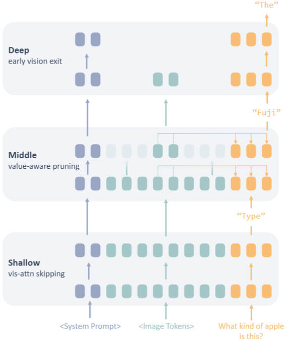
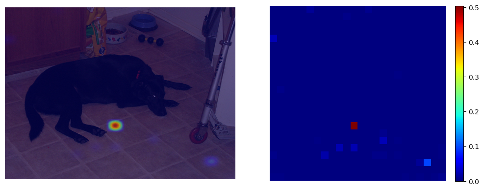
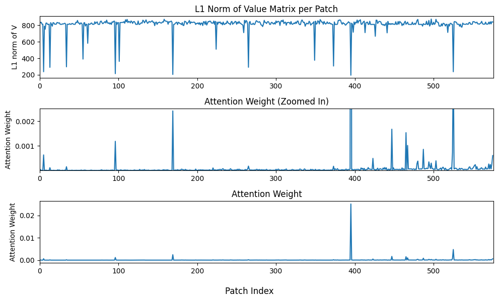

<h1 align="center"><b>VisiPruner: Decoding Discontinuous Cross-Modal Dynamics for Efficient Multimodal LLMs</b></h1>


## Abstract

Multimodal Large Language Models (MLLMs) have achieved strong performance across vision-language tasks, but suffer from significant computational overhead due to the quadratic growth of attention computations with the number of multimodal tokens. Though efforts have been made to prune tokens in MLLMs, *they lack a fundamental understanding of how MLLMs process and fuse multimodal information.* Through systematic analysis, we uncover a **three-stage** cross-modal interaction process: (1) Shallow layers recognize task intent, with visual tokens acting as passive attention sinks; (2) Cross-modal fusion occurs abruptly in middle layers, driven by a few critical visual tokens; (3) Deep layers discard vision tokens, focusing solely on linguistic refinement. Based on these findings, we propose *VisiPruner*, a training-free pruning framework that reduces up to 99\% of vision-related attention computations and 53.9\% of FLOPs on LLaVA-v1.5 7B. It significantly outperforms existing token pruning methods and generalizes across diverse MLLMs. Beyond pruning, our insights further provide actionable guidelines for training efficient MLLMs by aligning model architecture with its intrinsic layer-wise processing dynamics.

<p align="center">
  
</p>

## Install

1. Clone this repository and navigate to `LLaVA_visiPruner` folder

   ```bash
   git clone https://github.com/xxx
   cd LLaVA_visiPruner
   ```

2. Install Package

   ```bash
   conda create -n llava_visiPruner python=3.10 -y
   conda activate llava_visiPruner
   pip install --upgrade pip  # enable PEP 660 support
   pip install -e .
   ```

3. Install additional packages for training

   ```bash
   pip install -e ".[train]"
   pip install flash-attn --no-build-isolation
   ```


### Upgrade to latest code base

```bash
git pull
pip install -e .
```


## Visualization Tools

We provide several visualization tools to inspect intermediate results produced during model analysis. All dependencies required for visualization are already included in the Python package configuration file, so no additional installation is needed.

### 1.  Task Recognition

#### 1.1  Logits Lens Based

We employ a logits lens approach to uncover latent task information encoded in the representation of the last input token.

Location: `LLaVA_visiPruner/visualization/project_vo_to_semantic_space.ipynb`.

Example:
```
Layer 10 top tokens: ['number', 'zero', 'sterd', 'Zero', 'cyc']
Layer 11 top tokens: ['number', 'stor', 'VS', 'gem', 'cyc']
```


#### 1.2  Value-Output Based

Similar to the logits-lens view, the value–output matrix of the last input token captures hidden task semantics. We provide an easy-to-use Jupyter notebook for this analysis.

Location: `LLaVA_visiPruner/visualization/project_vo_to_semantic_space.ipynb`.

Example:
```
Layer 17 : ['Four', '四', 'fourth', 'four', 'four'] 
Layer 18 : ['four', 'five', 'three', 'six', 'four'] 
Layer 19 : ['numbers', 'counting', 'counted', 'numbers', 'counts'] 

```


### 2.  Attention Visualization

We also provide code for visualizing the distribution of attention over image regions.

Location: `LLaVA_visiPruner/visualization/attention_visualization.ipynb`




### 3.  $L1$ norm of Value Matrix

We show that the L1 norms of value vectors ($\mathcal{V}$) corresponding to attention sinks are significantly lower than those of normal visual tokens.

Location:`LLaVA_visiPruner/visualization/L1_norms_of_value_matrix.ipynb`




## Evaluation

Firstly, please prepare the data of evaluation following the instructions from LLaVA: https://github.com/haotian-liu/LLaVA/blob/main/docs/Evaluation.md. 

We provide ready-to-use evaluation scripts with default configurations for GQA, MME, and TextVQA benchmarks:

1. **run GQA**:
```bash
CUDA_VISIBLE_DEVICES=0 bash scripts/v1_5/visiPruner_eval/gqa.sh
```

2. **run MME**:
```bash
CUDA_VISIBLE_DEVICES=0 bash scripts/v1_5/visiPruner_eval/mme.sh
```

3. **run TextVQA**:
```bash
CUDA_VISIBLE_DEVICES=0 bash scripts/v1_5/visiPruner_eval/textvqa.sh
```

### Pruning configurations
You can modify hyperparameters using the --pruning-config argument in the provided bash scripts. Or, you can also run inference directly using:`./llava/serve/cli_pruning.py`.

For example:
```bash
--pruning-config '{"mode":["shallow","middle","deep"], "shallow_mid_layer":6,"layer_threshold":0.995, "tokens_threshold":0.2}'
```

- `mode`: Specifies which layers to prune (shallow, middle, or deep).

- `shallow_mid_layer`: Defines the boundary between shallow and middle layers.

- `layer_threshold`: Controls the pruning ratio by filtering layer.

- `tokens_threshold`: Controls the pruning ratio by remaining tokens.


## Citations
If you find this repository useful, please cite using this BibTeX:
```
@misc{fan2025visiprunerdecodingdiscontinuouscrossmodal,
      title={VisiPruner: Decoding Discontinuous Cross-Modal Dynamics for Efficient Multimodal LLMs}, 
      author={Yingqi Fan and Anhao Zhao and Jinlan Fu and Junlong Tong and Hui Su and Yijie Pan and Wei Zhang and Xiaoyu Shen},
      year={2025},
      eprint={2510.17205},
      archivePrefix={arXiv},
      primaryClass={cs.CV},
      url={https://arxiv.org/abs/2510.17205}, 
}
```
